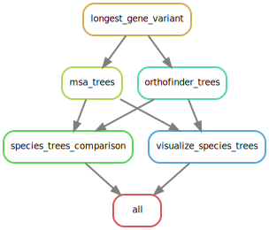
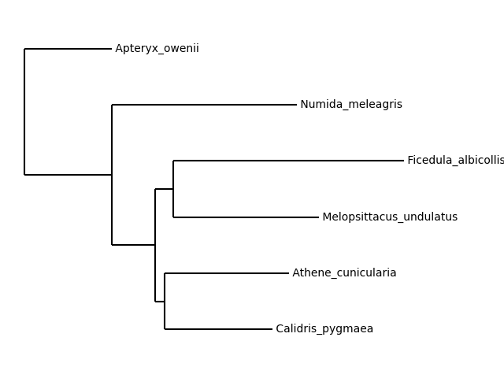
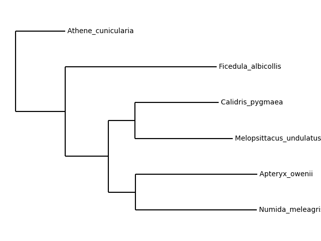
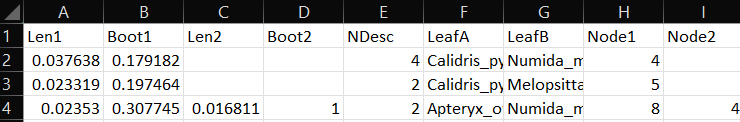

# BIOF501 Term Project: Generating the (Partial) Avian Phylogenetic Tree

### _By Brooks Perkins-Jechow_

___ 
## Repository Contents

### Directories

- data: contains the protein sequence files for the species of interest (see [below](#species-of-interest)). It will also contain the results files when the pipeline has finished runnning.

- expected_output: contains the expected results from running the pipeline. 

- MOTReeComparison: contains the files necessary to run the MOTreeComparison tool.

- tools: contains the Python script from OrthoFinder used in the first step of the pipeline.

### Files

- dag.svg: a directed acyclic graph (DAG) (aka a diagram) of the workflow. Can be viewed in browser.

- Snakefile: Snakemake instructions to run the pipeline.

_______

## Overview

Birds are a very diverse group of animals. To be precise, they are the most species-rich lineage of all tetrapod vertebrates [[1]](#references), and among these species is an extraordinary range of physical characteristics and abilities. Hummingbirds have heart rates that can vary from 1000 bpm when excited to 50 bpm when at rest. Owls have eyes so large that they cannot turn them in their sockets, and must instead rotate their heads up to 270 degrees. Arctic terns migrate 70,900 km per year in their trips from their breeding grounds in Iceland and Greenland to their wintering grounds in Antarctica and back. These varied capabilities imply an equally varied genetic makeup, a makeup which already informs our understanding of fields such as neuroscience, developmental biology, and immunology [[2]](#references)[[3]](#references)[[4]](#references).

This genetic variety also makes resolving the avian evolutionary tree an exceedingly difficult task. Pinning down the phylogenetic placement of one bird, the hoatzin, has been so difficult that it seems to be a running joke to describe it as "enigmatic" [[5]](#references)[[6]](#references). Other attempts at determining the relationships between species or families have ended with bemusingly different results [[7]](#references)[[8]](#references)[[9]](#references). Perhaps the most ambitious of these is the Bird 10K project, which, as its name implies, seeks to "generate draft genome sequences for about 10,500 extant bird species" [[10]](#references). However, the computing power necessary for only the first draft tree of 48 species was already excessive, amounting to >400 years of computing time  on a single processor and requiring 9 supercomputer centers[[11]](#references). Despite this, it may constitute the best chance for fully characterizing the avian phylogenetic tree and is making good progress [[12]](#references).

This pipeline attempts to construct a phylogenetic tree on a much smaller scale, using only six species representing a diverse range of orders as categorized in the IOC World Bird List version 12.2 [[13]](#references)(see species of interest [below](#species-of-interest)). This provides a selection large enough for a diverse tree, but not so large it is computationally onerous. It uses two different inference methods (outlined below) to produce two species trees, allowing us to compare them and observe the effect that different methods can have when predicting even small-scale phylogenetic trees. 

## Species of interest


Common name, species name (order, infraclass)

Little spotted kiwi, _Apteryx owenii_ (Apterygiformes, Galeoagnathae)

Helmeted guineafowl, _Numida meleagris_ (Galliformes, Galloanseres)

Budgerigar, _Melopsittacus undulatus_ (Psittaciformes, Neoaves)

Collared flycatcher, _Ficedula albicollis_ (Passeriformes, Neoaves)

Spoon-billed sandpiper, _Calidris pygmaea_ (Charadriiformes, Neoaves)

Burrowing owl, _Athene cunicularia_ (Strigiformes, Neoaves)

_____

## Workflow Overview



The key steps are detailed here:

- First, the pipeline runs an OrthoFinder script to select the longest variant of a given gene in each species file. This reduces the time and increases the accuracy of the succeeding steps.

- The pipeline then uses OrthoFinder [[14]](#references) to run two separate analyses: one infers the orthogroup trees using the default method, DendroBLAST [[15]](#references), a BLAST-based hierarchical clustering algorithm, while the other infers the orthogroup trees with MAFFT, a multiple sequence alignment (MSA) software [[16]](#references), and FastTree, which generates approximately-maximum-likelihood phylogenetic trees [[17]](#references).  

- We then use [MOTreeComparison](http://www.microbesonline.org/fasttree/treecmp.html) to directly compare the species trees. 

- Finally, [PlotTree](#https://github.com/iBiology/plottree) produces human-readable images of the trees. 
______


## Usage

The species data to be analyzed are provided. They are taken from the [ensemble.org](ensemble.org) genome database. If necessary, you can find a handy guide on finding and downloading the correct data in the OrthoFinder tutorial [here](https://davidemms.github.io/OrthoFinder_tutorials/running-an-example-OrthoFinder-analysis.html).

You will need [conda](https://conda.io/projects/conda/en/stable/user-guide/install/download.html) and [git](https://git-scm.com/book/en/v2/Getting-Started-Installing-Git) to install this pipeline.

Initialize a git repo in your desired location:

```
git init
```

Clone the repository and then navigate into it:

```
git clone https://github.com/bperkinsj/biof501project

cd biof501project/
```

At the time of writing the pipeline, conda had a bug that prevented creating an environment.yml file. You can follow the steps below to set up the environment with all the requisite packages. _IMPORTANT: do not attempt to install Python before Snakemake unless you specify the correct Python version. Installing Snakemake 3.13.3 will also install the necessary Python version. The pipeline **may not work** with versions of Python past 3.6.15_. 

```
conda deactivate

conda create -n birdenv

conda activate birdenv

conda install -c bioconda snakemake=3.13.3

conda install -c bioconda orthofinder=2.5.4

pip install plottree

pip install graphviz
```

Then you can start the pipeline!

```
snakemake --cores
```
____

## Results

The pipeline has 4 outputs: a message in the terminal showing the CompareTree results (consult the README in the MOTreeComparison directory if needed), a .csv file containing more precise comparisons of the species trees, and the two species tree images.

The message produced by CompareTree in the terminal should look like this:

```
Splits  Found   1       Total   3       Frac    0.3333  MaxLnDf 0.00672 Ratio   1.4     MaxBtDf 0.692
```

The species tree produced by MSA should look like this:



The species tree produced by the default DendroBLAST method should look like this:



The comparison table should look like this:



______

## Dependencies and versions

Python=3.6.15

Diamond=2.0.15

Snakemake=3.13.3

FastTree=2.1.11

MAFFT=7.508

OrthoFinder=2.5.4

Perl=5.32.1

Plottree=0.0.2

BioPython=1.79

Graphviz=0.19.1

_____

## References

OrthoFinder: Emms D.M. & Kelly S. (2019), Genome Biology 20:238

OrthoFinder species tree: Emms D.M. & Kelly S. (2017), MBE 34(12): 3267-3278
 Emms D.M. & Kelly S. (2018), bioRxiv https://doi.org/10.1101/267914

[1] F. Gill, D. Donsker, [IOC World Bird List](https://library.wur.nl/WebQuery/recommendeddb/find/2300064) (version 11.1) (2021)

[2] Zeigler, H. P., & Marler, P. (Eds.), [Behavioral neurobiology of birdsong](https://psycnet.apa.org/record/2004-16790-000), New York Academy of Sciences (2004)

[3] A. J. Stattersfield, M. J. Crosby, A. J. Long, D. C. Wege, [Endemic Bird Areas of the World: Priorities for Conservation](https://cir.nii.ac.jp/crid/1573105975027777280). BirdLife Conservation (BirdLife International, Cambridge, UK, 1998). Paper links: [Gene trees and species trees are not the same](https://www.cell.com/trends/ecology-evolution/fulltext/S0169-5347(01)02203-0)

[4] Susan M. Haig, Whitcomb M. Bronaugh, Rachel S. Crowhurst, Jesse D'Elia, Collin A. Eagles-Smith, Clinton W. Epps, Brian Knaus, Mark P. Miller, Michael L. Moses, Sara Oyler-McCance, W. Douglas Robinson, Brian Sidlauskas, Genetic Applications in Avian Conservation, The Auk, Volume 128, Issue 2, 1 April 2011, Pages 205–229, https://doi.org/10.1525/auk.2011.128.2.205

[5] Crair, Ben. "The Bizarre Bird that's Breaking the Tree of Life." _The New Yorker_, 15 Jul. 2022, https://www.newyorker.com/science/elements/the-bizarre-bird-thats-breaking-the-tree-of-life. Accessed 07 Dec. 2022

[6] Hughes, JM, and Baker, AJ, [Phylogenetic relationships of the enigmatic hoatzin (Opisthocomus hoazin) resolved using mitochondrial and nuclear gene sequences](https://pubmed.ncbi.nlm.nih.gov/10486983/), Mol Biol Evol. 1999 Sep;16(9):1300-7. doi: 10.1093/oxfordjournals.molbev.a026220.

[7] Hackett, S.J. et al. A Phylogenomic Study of Birds Reveals Their Evolutionary History. Science 320, 1763-1768 (2008). DOI: [10.1126/science.1157704](https://www.science.org/doi/10.1126/science.1157704)

[8] Prum, R., Berv, J., Dornburg, A. et al. A comprehensive phylogeny of birds (Aves) using targeted next-generation DNA sequencing. Nature 526, 569–573 (2015). https://doi.org/10.1038/nature15697

[9 Lewis, Dyani. "67 million-year-old fossil upends bird evolutionary tree." _Nature_, 30 Nov. 2022, https://www.nature.com/articles/s41586-022-05445-y. Accessed 07 Dec. 2022

[9] Hedges SB, Simmons MD, van Dijk MA, Caspers GJ, de Jong WW, Sibley CG. [Phylogenetic relationships of the hoatzin, an enigmatic South American bird](https://www.ncbi.nlm.nih.gov/pmc/articles/PMC40462/). Proc Natl Acad Sci U S A. 1995 Dec 5;92(25):11662-5. doi: 10.1073/pnas.92.25.11662. PMID: 8524824; PMCID: PMC40462.

[10] Zhang, G. Bird sequencing project takes off. Nature 522, 34 (2015). https://doi.org/10.1038/522034d

[11] Jarvis, E.D., et al. whole-genome analyses resolve early branches in the tree of life of modern birds. Science 346, 1320-133 (2014). DOI: [10.1126/science.1253451](https://www.science.org/doi/10.1126/science.1253451)

[12] Feng, S., Stiller, J., Deng, Y. et al. Dense sampling of bird diversity increases power of comparative genomics. Nature 587, 252–257 (2020). https://doi.org/10.1038/s41586-020-2873-9

[13] Gill F, D Donsker & P Rasmussen  (Eds). 2022. IOC World Bird List (v12.2). doi :  10.14344/IOC.ML.12.2.

[14] Emms, D.M., Kelly, S. OrthoFinder: phylogenetic orthology inference for comparative genomics. Genome Biol 20, 238 (2019). https://doi.org/10.1186/s13059-019-1832-y

[15] Kelly, S., and Maini, P.K. DendroBLAST: Approximate Phylogenetic Trees in the Absence of Multiple Sequence Alignments. PLOS One, 15 Mar. 2013. https://doi.org/10.1371/journal.pone.0058537

[16] Kazutaka Katoh, Daron M. Standley, MAFFT Multiple Sequence Alignment Software Version 7: Improvements in Performance and Usability, Molecular Biology and Evolution, Volume 30, Issue 4, April 2013, Pages 772–780, https://doi.org/10.1093/molbev/mst010

[17] Morgan N. Price, Paramvir S. Dehal, Adam P. Arkin, FastTree: Computing Large Minimum Evolution Trees with Profiles instead of a Distance Matrix, Molecular Biology and Evolution, Volume 26, Issue 7, July 2009, Pages 1641–1650, https://doi.org/10.1093/molbev/msp077